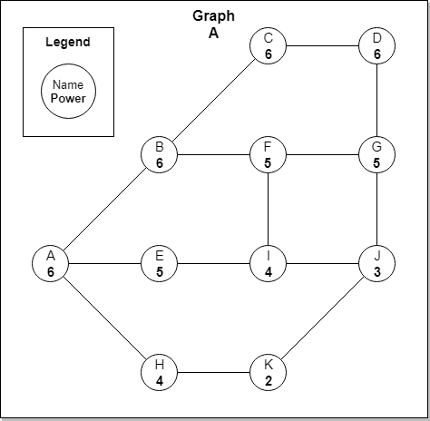

# Less Than Coloring - Find minimum days

Given a graph where each Node has property called Power and Color. Each node can only colors its neighbours if it has equal or greater Power than them. Each node will color the neighbours after they are completely colored.

The coloring process for each node will occur concurrently and takes 1 day.

Return minimum days required to color entire graph. Return 0 if graph cannot colored entirely.

## Input

- Start Node

## Output

- Minimum days to color the entire graph

## Example

- Start coloring red paint at Node A
- Minimum days is 3

## Explanation

- Start coloring red paint at Node A
- Day 1
  - A colors B, E, H
- day 2
  - B colors C, F
  - E colors I
  - H colors K
- Day 3
  - C colors D
  - F colors G, I
  - I colors J
- Minimum days is 3

## Constraint

- 1 <= number of node in a graph <= 26
- power node = non-negative integer
- Each node can connect with no node or n number of node
- Node can be colored by another node if the power node is equal or less than already colored node.
- Return 0 if not possible to color all node in a graph.
