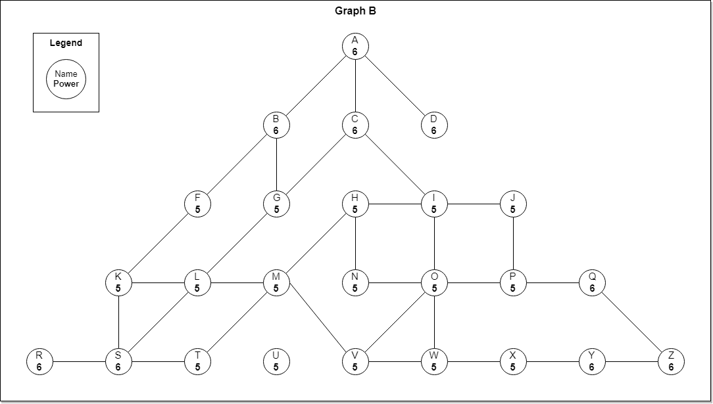

# Less Than Coloring - Find most color

Given a graph where each Node has property called Power and Color. Each node can only colors its neighbours if it has equal or greater Power than them. Each node will color the neighbours after they are completely colored.

The coloring process for each node will occur concurrently and takes 1 day.

If we color 2 nodes at the same time then the color will spread for a certain period of time, find which color colored the most nodes.

## Input

- Start node 1 with its color, start node 2 with its color and coloring duration

## Output

- String of most color in the node

## Example

- Node 1: node A (Red)
- Node 2: node Z (Blue)
- Coloring duration: 2
- Output: "Red"

## Explanation

- Day 1
  - A colors B, C, D
  - Z colors Q, Y
- Day 2
  - B colors F, G
  - C colors G, I
  - Q colors P
  - Y colors X
- Result:
  - Red = 7 (A, B, C, D, F, G, I)
  - Blue = 5 (P, Q, X, Y, Z)

## Constraint

- 1 <= number of node in a graph <= 28
- power node = non-negative integer
- Each node can connect with no node or n number of node
- Node can be colored by another node if the power node is equal or less than already colored node.
- List of color :
  - Blank
  - Red
  - Blue
  - Mixed
- Coloring rules :
  - Blank + Red = Red
  - Red + Red = Red
  - Blank + Blue = Blue
  - Blue + Blue = Blue
  - Red + Blue = Mixed (applies vice versa)
  - Mixed + Red = Mixed (applies vice versa)
  - Mixed + Blue = Mixed (applies vice versa)
