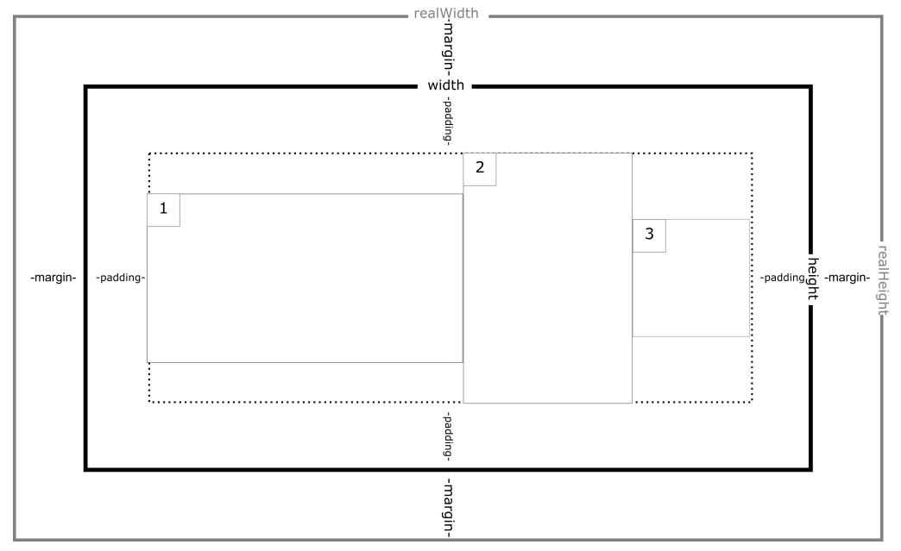

# View Tree - Calculate views

Your task is to calculate the realWidth & realHeight of all the views in a view tree.

There are a couple of view types :

1. View : A normal view.
   - The view realWidth and realHeight is determined by its width/height and its margin.

2.  ViewGroup : A ViewGroup is a view that can have a children.

    - The realWidth and realHeight is determined by its margin, padding and its children realWidth/realHeight if the width/height is -1 or wrap_content.

    - If it has a width/height the realWidth/realHeight is determined by its margin and its width/height (will ignore its children realWidth/realHeight).
    - There are two types of ViewGroup : FrameLayout and LinearLayout

      1. FrameLayout : A part of ViewGroup that will place all its children in the center.

      

      2. LinearLayout : A part of ViewGroup that will place all its children linearly either in POTRAIT or LANDSCAPE. Example linear layout with landscape orientation

      

## Input

- View (Look below to see the details of the view object)

## Output

- View with calculated realWidth and realheight.

## Example

- Input tree number 0 (Look below to see the details of the view object)
  - View "root-0" width 10 height 10 margin 5 padding 5
  - View realHeight is 20 and realWidth is 20
- Input tree number 1
  - FrameLayout "root-1" width -1 height -1 margin 5 padding 5
    - View "child-1-0" width 10 height 10 margin 5 padding 5
    - View "child-1-1" width 10 height 10 margin 5 padding 5
  - FrameLayout realHeight is 40 and realWidth is 40
- Input tree number 2
  - LinearLayout"root-2" width -1 height -1 margin 5 padding 5
    - View "child-2-0" width 10 height 10 margin 5 padding 5
    - View "child-2-1" width 10 height 10 margin 5 padding 5
  - realHeight 60 realWidth 40

## Constraint

- ViewGroup can also have a ViewGroup as its children.
- ViewGroup can also have no children.
- 1<= tree depth <= 5
- 1 <= number of views in a tree <= 30

Sample Case tree objects

| No  | ParentId | Id  | Type and Name      | Width | Height | Margin | Padding | Orientation |
| --- | -------- | --- | ------------------ | ----- | ------ | ------ | ------- | ----------- |
| 0   | null     | 0   | View   "root-0" | 10    | 10     | 5      | 5       | -           |
