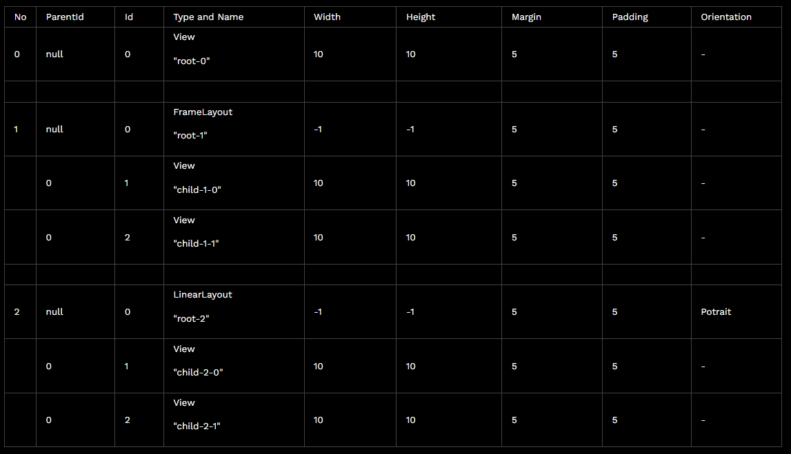

# View Tree - Find view

Your objective is to find if the view is exists in a layout tree given its id and return the path or return string empty "" if not exists.

## Input

- View (Look below to see the details of the view object)
- View id to find

## Output

- String path from root to that view if exists.

## Example

- rootView (id = 0)
  - child-0 (id = 1)
  - child-1 (id = 2)

FindView with id = 2

Result : "rootView/child-1"

- rootView (id = 0)
  - child-0 (id = 1)
  - child-1 (id = 2)

FindView with id 3

Result : ""

## Constraint

- 1<= tree depth <= 5
- 1 <= number of views in a tree <= 30
- Id is unique

## Sample Case tree objects

